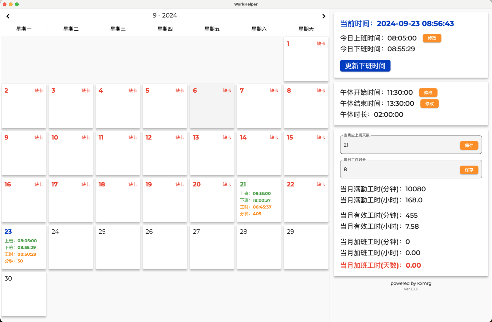

# Work Helper

使用 Flutter 开发的打工人加班工时计算工具，依赖 [GetxScaffold](https://github.com/Kxmrg/flutter_getx_scaffold) 快速开发框架。



### 编译说明

因项目依赖[GetxScaffold](https://github.com/Kxmrg/flutter_getx_scaffold)，如本地已下载[GetxScaffold](https://github.com/Kxmrg/flutter_getx_scaffold)源码，请修改 pubspec.yaml 文件里的 getx_scaffold 路径。

```
dependencies:
  flutter:
    sdk: flutter
  getx_scaffold:
    path: ../getx_scaffold
  window_manager: ^0.4.2
  calendar_view: ^1.2.0
  hive: ^2.2.3
  hive_flutter: ^1.1.0
  time_pickerr: ^1.0.6
```

如果未下载[GetxScaffold](https://github.com/Kxmrg/flutter_getx_scaffold)源码，将 getx_scaffold 修改为 Pub 仓库地址。

```
dependencies:
  flutter:
    sdk: flutter
  getx_scaffold: ^0.2.1
  window_manager: ^0.4.2
  calendar_view: ^1.2.0
  hive: ^2.2.3
  hive_flutter: ^1.1.0
  time_pickerr: ^1.0.6
```

```
flutter pub get
flutter run
#编译windows版本
flutter build windows
#编译mac版本
flutter build macos
```
